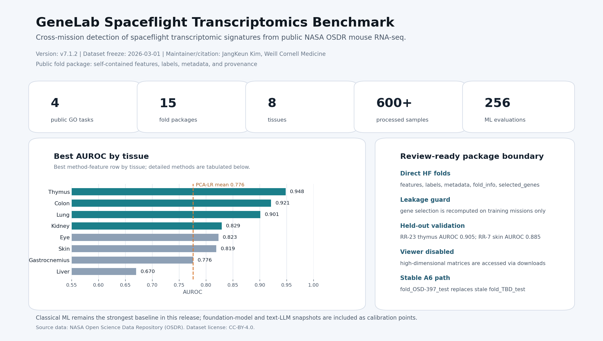

# SpaceBio-Bench

**Mission-held-out transcriptomics benchmarks for evaluating whether AI/ML and
foundation models generalize spaceflight biological signatures across missions,
tissues, and model systems.**

Former public name: **GeneLab Benchmark**. The v1-v7 historical benchmark
surface keeps that name; SpaceBio-Bench is the forward-looking platform name.

[](https://huggingface.co/datasets/jang1563/genelab-benchmark)
[](LICENSE)

<p align="center">
  
</p>

Maintainer / citation author: JangKeun Kim, Weill Cornell Medicine.

Current public release note: **v7.1.2 public-card/metadata patch** over
canonical v7.1 results. The patch updates documentation, public metadata, and
access guidance; it does not introduce new benchmark result generation. Dataset
freeze: **2026-03-01**.

## What This Is

SpaceBio-Bench evaluates a practical space-biology question:

> If a model learns a transcriptomic spaceflight signature from one mission,
> can it recognize that signature in a different mission it has never seen?

The current public benchmark uses NASA Open Science Data Repository (OSDR)
spaceflight transcriptomics, with emphasis on mouse multi-tissue bulk RNA-seq,
mission-held-out validation, and transparent release boundaries.

## Current Public Surfaces

| Surface | Public status | Use it for | Entry point |
|---|---|---|---|
| v7.1 GeneLab Benchmark | Canonical historical result surface | v1-v7 results, public fold package, citation | [Canonical results](docs/CANONICAL_RESULTS_V7_1.md) |
| Hugging Face dataset | Public processed fold package | Download selected LOMO feature matrices and result artifacts | [HF dataset card](docs/hf_dataset_card.md) |
| v9 public bulk | Metadata catalog | Task catalog, source inventory, and baseline summaries | [v9 HF-style card](docs/v9_hf_dataset_card.md) |

For linked methods, evaluation, and release-status notes, start with the
[SpaceBio-Bench public documentation map](docs/SPACEBIOBENCH_TRANSPARENCY_CARD_PACK.md).
For machine-readable release status, see
[release/release_manifest.json](release/release_manifest.json).

## Benchmark Design

| Layer | Design choice |
|---|---|
| Core split | Leave-One-Mission-Out (LOMO); mission is the independence unit |
| Primary label | Flight vs. ground control in public spaceflight transcriptomics |
| Main data source | NASA OSDR mouse spaceflight RNA-seq |
| Feature surfaces | Gene expression, Hallmark pathways, KEGG pathways, combined pathway features |
| Model tracks | Classical ML, gene-expression foundation models, text LLMs, graph/network baselines |
| Evaluation | AUROC, bootstrap confidence interval, permutation p-value, task-specific diagnostics |
| Leakage guard | Fold-specific variance filtering is computed on training missions only |

## Scope At A Glance

| Dimension | v1-v7 public benchmark surface |
|---|---|
| Tissues | 8: liver, gastrocnemius, kidney, thymus, skin, eye, lung, colon |
| Public OSDR source catalog | 24+ OSD accessions |
| Processed sample scope | 600+ binary/control samples across release layers |
| v4 multi-method grid | 8 tissues x 8 classifiers x 4 feature types = 256 evaluations |
| Model families | Classical ML, 4 gene-expression foundation models, 3 text LLMs |
| Public HF fold package | Selected reviewer-facing LOMO tasks with train/test matrices and metadata |

## Headline Results

The v7.1 canonical result source is
[docs/CANONICAL_RESULTS_V7_1.md](docs/CANONICAL_RESULTS_V7_1.md).

| Result surface | Takeaway |
|---|---|
| Multi-method benchmark | PCA-LR is the strongest 8-tissue gene-level baseline in v4, with mean AUROC 0.776. |
| Best tissue rows | Thymus 0.948, colon 0.921, lung 0.901, kidney 0.829 across best method-feature combinations. |
| Cross-mission transfer | Thymus and gastrocnemius show the strongest mission-transfer signal; liver and kidney are harder. |
| Pathway features | Pathway representations rescue some weaker gene-level tissues, especially kidney and eye. |
| Foundation models | Tested gene-expression foundation models underperform tuned classical baselines on small-n bulk RNA-seq mission shift. |
| Held-out validation | Thymus RR-23 AUROC 0.905; skin RR-7 AUROC 0.885. |

The original long-form README content is preserved at
[docs/README_LONGFORM_V7_1_ARCHIVE_2026_06_15.md](docs/README_LONGFORM_V7_1_ARCHIVE_2026_06_15.md).

## Quick Start

### Load A Public Fold From Hugging Face

```bash
pip install -r requirements.txt huggingface_hub
```

```python
from huggingface_hub import hf_hub_download
import pandas as pd

repo_id = "jang1563/genelab-benchmark"
fold = "A5_skin_lomo/fold_RR-7_test"

def hf_csv(name):
    return pd.read_csv(
        hf_hub_download(
            repo_id=repo_id,
            filename=f"{fold}/{name}",
            repo_type="dataset",
        ),
        index_col=0,
    )

train_X = hf_csv("train_X.csv")
train_y = hf_csv("train_y.csv").iloc[:, 0]
test_X = hf_csv("test_X.csv")
test_y = hf_csv("test_y.csv").iloc[:, 0]

print(f"Train: {train_X.shape}, Test: {test_X.shape}")
```

Each public fold includes feature matrices, labels, sample metadata,
`fold_info.json`, and `selected_genes.txt`.

### Validate The Public Release Manifest

```bash
make release-qa
make hpc-public-qa
python3 scripts/validate_release_manifest.py
python3 -m unittest tests/test_release_manifest.py
```

Create a dry-run Hugging Face upload plan:

```bash
make hf-upload-plan HF_TASK=A5 HF_UPLOAD_PLAN=/tmp/spacebiobench_hf_upload_plan_A5.json
```

### Reproduce From OSDR Inputs

Raw-data reproduction requires R/Bioconductor and task-specific preprocessing.
See [docs/r_dependencies.md](docs/r_dependencies.md) and the scripts under
[scripts/](scripts/).

## Repository Map

```text
tasks/                 Public v1 LOMO task inputs and selected fold packages
evaluation/            Historical v1 result JSON and summaries
v2/ ... v7/            Completed historical benchmark layers
v9/                    Public bulk metadata catalog and extension workspaces
docs/                  Cards, canonical results, methods, plans, and release notes
release/               Machine-readable public release manifest
scripts/               Data, evaluation, upload, validation, and figure scripts
```

## Key Documents

| Need | Document |
|---|---|
| Public result source | [docs/CANONICAL_RESULTS_V7_1.md](docs/CANONICAL_RESULTS_V7_1.md) |
| Public documentation map | [docs/SPACEBIOBENCH_TRANSPARENCY_CARD_PACK.md](docs/SPACEBIOBENCH_TRANSPARENCY_CARD_PACK.md) |
| System scope | [docs/SPACEBIOBENCH_SYSTEM_CARD.md](docs/SPACEBIOBENCH_SYSTEM_CARD.md) |
| Evaluation interpretation | [docs/SPACEBIOBENCH_EVALUATION_CARD.md](docs/SPACEBIOBENCH_EVALUATION_CARD.md) |
| Release status | [docs/SPACEBIOBENCH_RELEASE_READINESS_CARD.md](docs/SPACEBIOBENCH_RELEASE_READINESS_CARD.md) |
| Public statement guide | [docs/SPACEBIOBENCH_CLAIM_REGISTER.md](docs/SPACEBIOBENCH_CLAIM_REGISTER.md) |
| Hugging Face dataset card source | [docs/hf_dataset_card.md](docs/hf_dataset_card.md) |
| v9 metadata catalog card source | [docs/v9_hf_dataset_card.md](docs/v9_hf_dataset_card.md) |
| Contributing and submissions | [CONTRIBUTING.md](CONTRIBUTING.md) and [docs/submission_format.md](docs/submission_format.md) |
| Machine-readable release state | [release/release_manifest.json](release/release_manifest.json) |

## Data And Release Notes

All source data is derived from publicly available NASA OSDR resources. Code is
MIT licensed. The processed public dataset package follows the license declared
in the Hugging Face dataset card; upstream OSDR datasets should be cited and
used under their individual terms.

Release labels are intentionally separated:

- **v7.1**: canonical historical result surface and citation target.
- **v9 public bulk**: metadata catalog and baseline-summary surface.

## Contributing

Use [CONTRIBUTING.md](CONTRIBUTING.md) for documentation fixes, data-access
reports, reproducibility issues, and public benchmark submissions. Prediction
submissions should follow [docs/submission_format.md](docs/submission_format.md).

## Citation

Please cite the software using [CITATION.cff](CITATION.cff). GitHub renders the
same citation metadata in the repository citation panel.

```bibtex
@dataset{kim2026genelab,
  title = {SpaceBio-Bench / GeneLab Benchmark: Mission-Held-Out Spaceflight Transcriptomics Benchmark},
  author = {Kim, JangKeun},
  year = {2026},
  url = {https://huggingface.co/datasets/jang1563/genelab-benchmark},
  note = {v7.1.2 documentation, public-card, and metadata patch over canonical v7.1 results; data freeze 2026-03-01}
}
```
